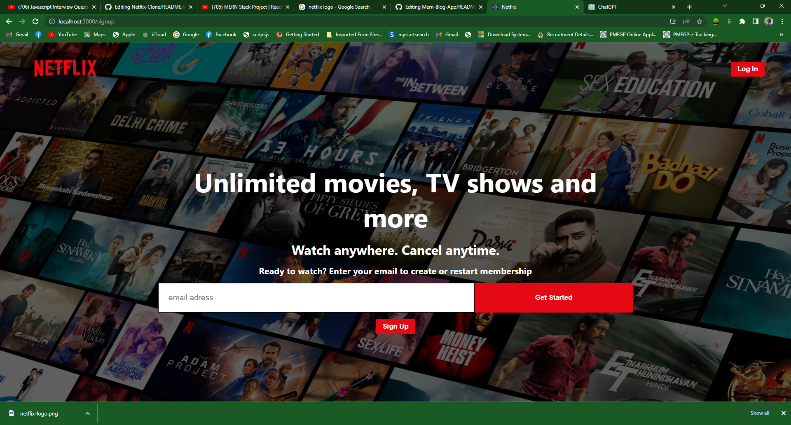
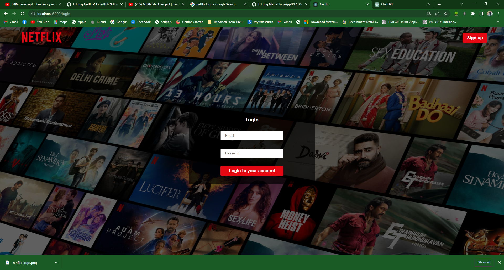

# project-documentation

  

<h3 align="center">Fullstack Netflix-Clone</h3>

---

In this project,Student informations such as name and address are collected and stored inside a database.
      

## 📝 Table of Contents
- [About](#about)
- [Getting Started](#getting_started)
- [Deployment](#deployment)
- [Usage](#usage)
- [Built Using](#built_using)
- [TODO](../TODO.md)
- [Contributing](../CONTRIBUTING.md)
- [Authors](#authors)
- [Acknowledgments](#acknowledgement)

## 🧐 About 
    Netflix is a popular streaming service that offers a wide range of movies, TV shows, documentaries, and other forms of digital media. It was founded in 1997 by Reed Hastings and Marc Randolph in Los Gatos, California. Originally, Netflix operated as a DVD rental-by-mail service, but in 2007, it introduced its streaming service, which marked a significant shift in the company's business model.

Netflix's streaming platform allows subscribers to watch content instantly on various devices, such as smart TVs, computers, smartphones, and tablets, as long as they have an internet connection. It offers a vast library of movies and TV series, including both licensed content and original productions known as Netflix Originals.

Netflix has gained popularity due to its convenience, affordability, and extensive content library. It has expanded its presence globally and is available in many countries. The streaming service offers various subscription plans with different features and pricing options. Subscribers can create individual profiles within a single account, allowing personalized recommendations and the ability to track viewing history.

One of the notable aspects of Netflix is its investment in producing original content. It has created critically acclaimed TV shows and movies such as "Stranger Things," "The Crown," "Narcos," "Bird Box," and "The Irishman," among many others. These original productions have contributed to Netflix's success and helped differentiate it from other streaming platforms.

Netflix has faced competition from other streaming services, such as Amazon Prime Video, Hulu, Disney+, HBO Max, and others. To stay competitive, Netflix continues to invest in original content, strike partnerships with various studios, and expand its global reach.

Please note that the above information is based on the knowledge available up until September 2021, and there may have been changes or developments in Netflix's services and offerings since then.
## 🏁 Getting Started 
Getting Started with Create React App
This project was bootstrapped with Create React App.
### Prerequisites
Before getting started, ensure that you have the following prerequisites installed:

You need to install
* [MongoDB](https://www.mongodb.com/cloud/atlas/register)
* [ExpressJs](https://expressjs.com/)
* [React Js](https://legacy.reactjs.org/)
* [Nodejs](https://nodejs.org/en/download)
* [VS code](https://code.visualstudio.com/download)

For Testing API
* [Post Man](https://www.postman.com/downloads/)

### Installing

Create React App
Available Scripts
In the project directory, you can run:

npm start
Runs the app in the development mode.
Open http://localhost:3000 to view it in your browser.

The page will reload when you make changes.
You may also see any lint errors in the console.

npm test
Launches the test runner in the interactive watch mode.
See the section about running tests for more information.

npm run build
Builds the app for production to the build folder.
It correctly bundles React in production mode and optimizes the build for the best performance.

The build is minified and the filenames include the hashes.
Your app is ready to be deployed!

See the section about deployment for more information.

npm run eject
Note: this is a one-way operation. Once you eject, you can't go back!

If you aren't satisfied with the build tool and configuration choices, you can eject at any time. This command will remove the single build dependency from your project.

Instead, it will copy all the configuration files and the transitive dependencies (webpack, Babel, ESLint, etc) right into your project so you have full control over them. All of the commands except eject will still work, but they will point to the copied scripts so you can tweak them. At this point you're on your own.

You don't have to ever use eject. The curated feature set is suitable for small and middle deployments, and you shouldn't feel obligated to use this feature. However we understand that this tool wouldn't be useful if you couldn't customize it when you are ready for it.

Learn More
You can learn more in the Create React App documentation.

To learn React, check out the React documentation.

Code Splitting
This section has moved here: https://facebook.github.io/create-react-app/docs/code-splitting

Analyzing the Bundle Size
This section has moved here: https://facebook.github.io/create-react-app/docs/analyzing-the-bundle-size

Making a Progressive Web App
This section has moved here: https://facebook.github.io/create-react-app/docs/making-a-progressive-web-app

Advanced Configuration
This section has moved here: https://facebook.github.io/create-react-app/docs/advanced-configuration

Deployment
This section has moved here: https://facebook.github.io/create-react-app/docs/deployment

npm run build fails to minify
This section has moved here: https://facebook.github.io/create-react-app/docs/troubleshooting#npm-run-build-fails-to-minify

IntelliJ IDEA Community Edition:
These instructions will help you build IntelliJ IDEA Community Edition from source code, which is the basis for IntelliJ Platform development. The following conventions will be used to refer to directories on your machine:

<USER_HOME> is your home directory.
<IDEA_HOME> is the root directory for the IntelliJ source code.
Getting IntelliJ IDEA Community Edition Source Code
IntelliJ IDEA Community Edition source code is available from github.com/JetBrains/intellij-community by either cloning or downloading a zip file (based on a branch) into <IDEA_HOME>. The default is the master branch.

The master branch contains the source code which will be used to create the next major version of IntelliJ IDEA. The branch names and build numbers for older releases of IntelliJ IDEA can be found on the page of Build Number Ranges.

These Git operations can also be done through the IntelliJ IDEA user interface.

Speed Tip: If the complete repository history isn't needed then using a shallow clone (git clone --depth 1) will save significant time.

On Windows: Two git options are required to check out sources on Windows. Since it's a common source of Git issues on Windows anyway, those options could be set globally (execute those commands before cloning any of intellij-community/android repositories):

git config --global core.longpaths true
git config --global core.autocrlf input
IntelliJ IDEA Community Edition requires additional Android modules from separate Git repositories. To clone these repositories, run one of the getPlugins scripts located in the <IDEA_HOME> directory. These scripts clone their respective master branches. Make sure you are inside the <IDEA_HOME> directory when running those scripts, so the modules get cloned inside the <IDEA_HOME> directory.

getPlugins.sh for Linux or macOS.
getPlugins.bat for Windows.
Note: Always git checkout the intellij-community and android Git repositories to the same branches/tags.

Building IntelliJ Community Edition
Version 2023.1.1 or newer of IntelliJ IDEA Community Edition or IntelliJ IDEA Ultimate Edition is required to build and develop for the IntelliJ Platform.

Opening the IntelliJ Source Code for Build
Using IntelliJ IDEA File | Open, select the <IDEA_HOME> directory.

If IntelliJ IDEA displays an error about a missing or out of date required plugin (e.g. Kotlin), enable, upgrade, or install that plugin and restart IntelliJ IDEA.
IntelliJ Build Configuration
It's recommended to use JetBrains Runtime 17 to compile the project. When you invoke Build Project for the first time, IntelliJ IDEA should suggest downloading it automatically.
If the Maven plugin is disabled, add the path variable "MAVEN_REPOSITORY" pointing to <USER_HOME>/.m2/repository directory.
Make sure you have at least 8GB of RAM on your computer. With the bare minimum of RAM, disable "Compile independent modules in parallel" option in the compiler settings. With notably more memory available, increase "User-local build process heap size" to 3000 - that will greatly reduce compilation time.
Note that it is important to use the variant of JetBrains Runtime without JCEF. So, if for some reason jbr-17 SDK points to an installation of JetBrains Runtime with JCEF, you need to change it: ensure that IntelliJ IDEA is running in internal mode (by adding idea.is.internal=true to idea.properties file), navigate to jbr-17 item in Project Structure | SDKs, click on 'Browse' button, choose 'Download...' item and select version 17 and vendor 'JetBrains Runtime'.

Building the IntelliJ Application Source Code
To build IntelliJ IDEA Community Edition from source, choose Build | Build Project from the main menu.

To build installation packages, run the installers.cmd command in <IDEA_HOME> directory. installers.cmd will work on both Windows and Unix systems.

Options to build installers are passed as system properties to installers.cmd command. You may find the list of available properties in BuildOptions.kt

Examples (./ should be added only for Linux/macOS):

Build installers only for current operating system: ./installers.cmd -Dintellij.build.target.os=current
Build source code incrementally (do not build what was already built before): ./installers.cmd -Dintellij.build.incremental.compilation=true
installers.cmd is used just to run OpenSourceCommunityInstallersBuildTarget from the command line. You may call it directly from IDEA, see run configuration Build IDEA Community Installers (current OS) for an example.

Dockerized Build Environment
To build installation packages inside a Docker container with preinstalled dependencies and tools, run the following command in <IDEA_HOME> directory (on Windows, use PowerShell):
docker run --rm -it -v ${PWD}:/community $(docker build -q . --target build_env)

Running IntelliJ IDEA
To run the IntelliJ IDEA built from source, choose Run | Run from the main menu. This will use the preconfigured run configuration "IDEA".

To run tests on the build, apply these setting to the Run | Edit Configurations... | Templates | JUnit configuration tab:

Working dir: <IDEA_HOME>/bin
VM options:
-ea
You can find other helpful information at https://www.jetbrains.com/opensource/idea. The "Contribute Code" section of that site describes how you can contribute to IntelliJ IDEA.

Running IntelliJ IDEA on CI/CD environment
To run tests outside of IntelliJ IDEA, run the tests.cmd command in <IDEA_HOME> directory. tests.cmd will work on both Windows and Unix systems.

Options to run tests are passed as system properties to tests.cmd command. You may find the list of available properties in TestingOptions.kt

Examples (./ should be added only for Linux/macOS):

Build source code incrementally (do not build what was already built before): ./tests.cmd -Dintellij.build.incremental.compilation=true
Run a specific test: ./tests.cmd -Dintellij.build.test.patterns=com.intellij.util.ArrayUtilTest
tests.cmd is used just to run CommunityRunTestsBuildTarget from the command line. You may call it directly from IDEA, see run configuration tests in community for an example.

## 🔧 Running the tests 
The outputs at the frontend,database and backend parts are attached below.

### Break down into end to end tests
Front end:

### And coding style tests
During debugging,the output is shown below,

## 🎈 Usage 
This project is used to create Full stack student information system using Spring Boot and React. In this project, we will use Spring Boot ( MVC, JPA, Hibernate) and Mysql Database to create the Backend application (Restful web service API) with and use React.js to create the frontend application with Material UI and React Hooks( useState, useEffect) with functional components. 

## 🚀 Deployment 
This section has moved here: https://facebook.github.io/create-react-app/docs/deployment

## ⛏️ Built Using 
- [MongoDB](https://www.mongodb.com/) - Database
- [Express](https://expressjs.com/) - Server Framework
- [React](https://legacy.reactjs.org/docs/getting-started.html) - Web Framework
- [NodeJs](https://nodejs.org/en/) - Server Environment

## ✍️ Authors 
We are grateful to the authors of existing related projects for their ideas and collaboration:

@skill-lync

See also the list of [contributors](https://github.com/skill-lync-cs/project-documentation) who participated in this project.

## 🎉 Acknowledgements 
- Skill-Lync
